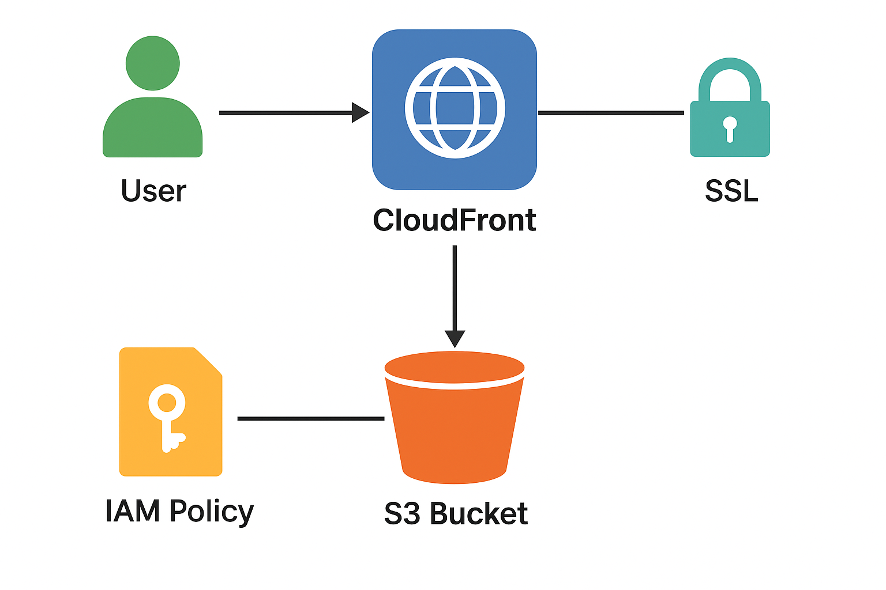
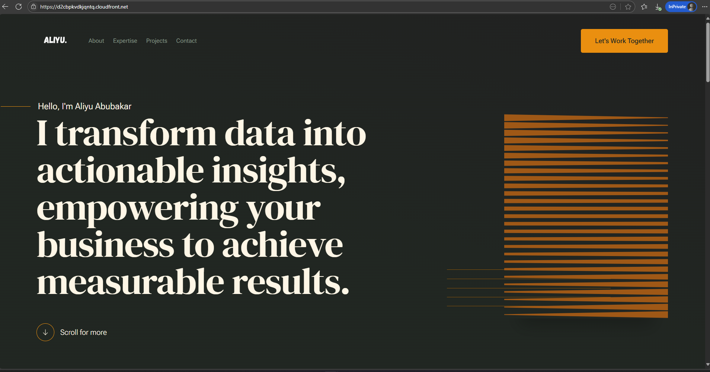
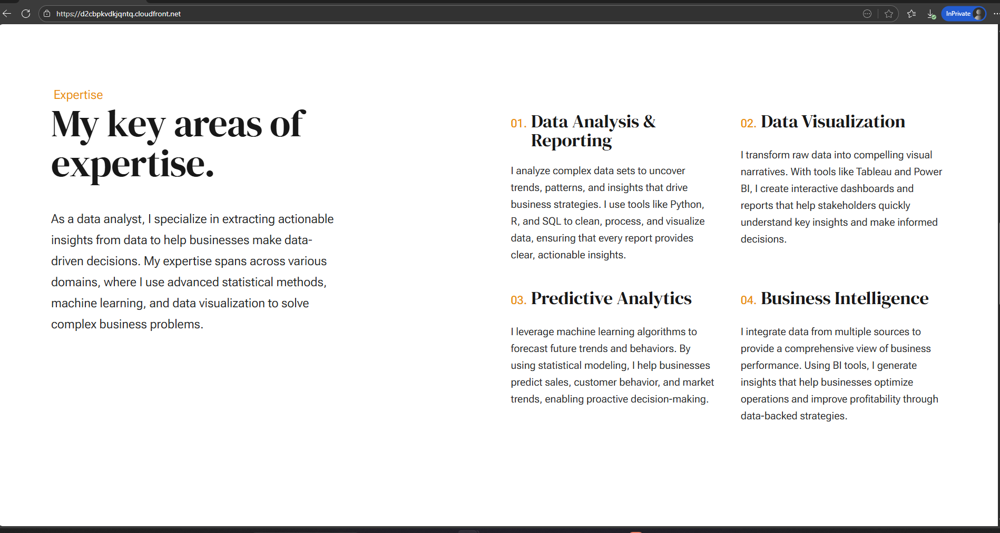

# 🌐 Static Website Hosting on AWS (S3 + CloudFront + ACM)

## 📖 Project Overview
I built a static website hosted entirely on AWS using **Amazon S3, CloudFront, ACM, and IAM**.  
The site is globally distributed, secure with HTTPS, and fully within the **AWS Free Tier**.  

- **Use case:** Personal portfolio / static website.  
- **AWS Services:** S3, CloudFront, ACM, IAM (OAC).  
- **Cost:** $0 (Free Tier).  
- **Live Demo:** [Visit Site](https://d2cbpkvdkjqntq.cloudfront.net)  

---

## 🏗️ Architecture

**Flow:**
The static site architecture is designed for **secure, global, and cost-efficient delivery**:

1. **User Request** → A visitor requests the site from their browser.  
2. **CloudFront Distribution** → The request first hits CloudFront, which:  
   - Redirects HTTP → HTTPS.  
   - Uses an **ACM SSL certificate** to serve traffic securely.  
   - Checks the **edge cache** for the requested object.  
3. **Cache Decision** →  
   - If the object is cached → CloudFront serves it directly from the nearest edge location.  
   - If not cached → CloudFront forwards the request to the origin.  
4. **S3 Origin (Static Files)** →  
   - The S3 bucket stores all website files (`index.html`, CSS, JS, images).  
   - The bucket is locked down to private access.  
   - **Origin Access Control (OAC)** allows CloudFront (and only CloudFront) to fetch files securely.  
5. **Response** → The object is cached at CloudFront and delivered back to the user with low latency.  

This setup ensures the website is **fast, secure (HTTPS), and free-tier friendly** while preventing direct public access to the S3 bucket.

---

## ⚙️ Implementation Steps

1. **Provision S3 Bucket**
   - Created a private S3 bucket.  
   - Uploaded `index.html` and supporting assets.  

2. **Configure CloudFront**
   - Origin: S3 bucket.  
   - Viewer protocol policy: Redirect HTTP → HTTPS.  
   - Default root object: `index.html`.  
   - Enabled edge caching for faster delivery.  

3. **Secure Bucket with OAC**
   - Disabled all public access to the bucket.  
   - Attached **Origin Access Control (OAC)** to CloudFront.  
   - Applied a bucket policy that allows only CloudFront to access the bucket.

4. **Enable HTTPS (ACM)**
   - CloudFront auto-assigned SSL certificate.  

5. **Invalidate Cache**
   - Created invalidation (`/*`) to refresh updated files.  

---

## 🚧 Challenges & Fixes
- **403 Forbidden (Access Denied)** → Solved by attaching OAC + updating bucket policy.  
- **404 NoSuchKey** → Fixed by uploading `index.html` to root + setting default root object.  

---

## ✅ Outcome
- Static site hosted with **global CDN distribution**.
- Content is cached at CloudFront edge locations for speed.
- Secure HTTPS access via CloudFront domain.  
- Free-tier friendly, no ongoing costs.

---

## 📸 Screenshots

### Homepage
** 

**  
